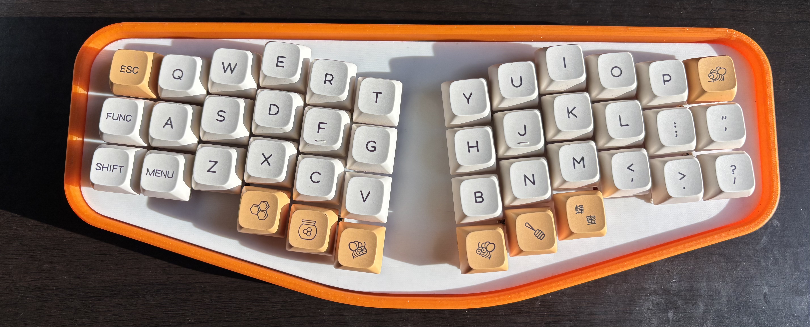
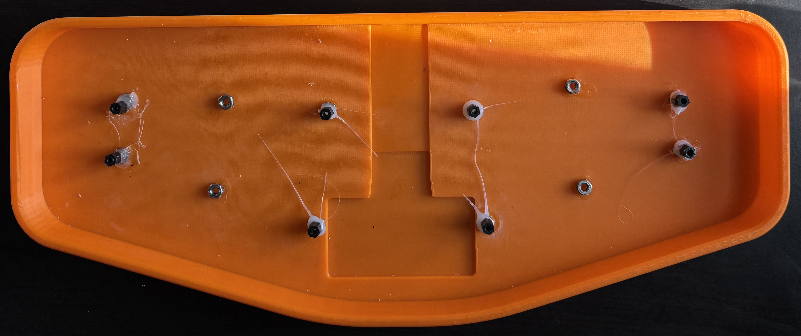

# Ali - Custom 42 key handwired ergonomic keyboard

## **Documentation - Important for building**

This is the first keyboard I have ever designed and the first revision of the board. The following text has a lot of tips on how to get around some of the desigin flaws in this revision and helpful tips for building. There are definitely design elements I’d like to improve and features I'd like to add in a revision 2, but I am still pretty happy with this as my first keyboard project. Thanks for all the support and happy building. :) 

Parts Needed
- 42 MX style switches
- 42 1N4148 diodes
- 42 1u keycaps
- Insulated stranded/solid core copper wire
- 1 nice!nano v2 microcontroller or suitable clone (such as supermini nrf52840)
- 1 3.7v lithium ion battery
- M2 10mm standoffs (important note about standoffs)
- M2 8mm screws
- 8mm x 2mm rubber bumper (for case front feet)
- 11mm x 5 mm rubber bumper (for case rear feet)

## Standoffs
Dependning on which standoffs you buy, they may or may not fit in the holes on the case. The holes on the case are 4mm in diameter, but I have been M2 standoffs with outer diameters anywhere from 2.9-5mm. This was the case with me, but I got around it but by screwing the actual standoff to the plate alone, dabbing hot glue in the correct locations for the standoffs in the case, then pressing standoffs attacted to the plate into the glue. You can then unscrew the plate, and the standoffs will be the correct position. It is very important to note that hot glue dries very fast, so if you do this you need to move fast. The hot glue allows for you to remove it if your placement isn't how you like it. You can reinforce with super glue after you get the placement right if you wish, but the hot glue is pretty strong on its own. This is obviously not ideal, but the position of the screws/screwless design require this to have skinny standoffs to not interfere with handwiring. I would like to improve this in a Revision 2.

## Case and Plate Files 
In the case and plate file you will find 2 types of plates: one with 1mm case clearence and one with .5mm case clearence. My original design is 1mm, but if you would like less of a gap between the case and the plate, you can use the .5mm clearence plate. The cutout on the bottom of the case is meant for a battery if your battery is too big to fit under the microcontroller. The microcontroller cutout is not at all the right size but creates additional space if you wanted to put the battery under the controller like I did. I would also highly recommend gluing a piece of plastic to the plate to prevent the microcontroller from moving when inserting a usb-c cable.

## 3D Printing 
When 3D printing the case and plate, I would recommend 100% infill or as close to 100% as possible to ensure the best acoustics. Lower infill = a more hollow sound.

## Wiring Guide / Firmware

**IMPORTANT** - This board was wired **row2col** instead of the more common col2row. This means when wiring, you need to make sure the strip of the diode is on the same side as the row. If you wire this board col2row, the keymap will be mirrored. This is shown in the picture below.

FOLLOWING THIS GUIDE ENSURES DEFAULT FIRMWARE FUNCTIONALITY, IF YOU DO NOT USE THE SAME PINS YOU WILL NEED TO CHANGE THE PINS IN THE OVERLAY FILE AND RECOMPILE.
I highly recommend learning to recompile the firmware if you ever want to change the keymap from mine. (I PRESS B WITH MY RIGHT HAND SO YOU DEFINITELY WILL NEED TO IF YOU DONT) It is also just a good skill to have for your future projects. If you do not know how to, I would highly recommend reading the ZMK documentation, or watching this youtube video by Joe Scotto (https://www.youtube.com/watch?v=O_urj-rF3bQ) and using my files as a guide.

